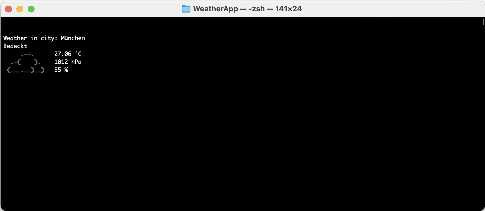

# Terminal Weather Report

A simple Python script to run in the terminal to get a quick weather report. 



# Dependencies
```
pip install tabulate
```
And a UTF-8 terminal with 256 colors

# Getting started
Create a free account on [OpenWeather](https://openweathermap.org) and get your API key for current weather.
You can find their docs [here](https://openweathermap.org/current).

Create an empty text file and paste your API key in it.
Now you are ready to go. For example you can run...

```
python weather_report.py -c München -u metric -l de
```

...to get the current weather for the city Munich. 

## Parser arguments
```python
    parser = argparse.ArgumentParser(description='WeatherApp')
    parser.add_argument('-c', required=True, help='Your City')
    parser.add_argument('-u', choices=['metric', 'imperial'], help='Temperature is available in Fahrenheit, Celcius and Kelvin units.'
                                                                        'For temperature in Fahrenheit use units=imperal'
                                                                        'For temperature in Celcius use units=metric'
                                                                        'Temperature in Kelvin is used by default')
    parser.add_argument('-l', default='en', help='You can use this parameter to get the output in your language')
```

# Special thanks
Many thanks to the guys from [wego](https://github.com/schachmat/wego) where I got the unicode icons and the mapping to the OpenWeather codes. 